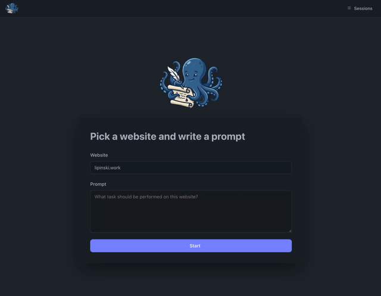

# WebOctoScribe


Web browser annotation tool. Navigate websites through a headless browser, record each action with explanations, and replay or export the annotated sessions.

[tool usage better quality](https://youtu.be/quSNzp0g9pA)



[sessions better quality](https://youtu.be/hcvmA9Igq6Y)


## Setup

Requires Python 3.12+ and [uv](https://docs.astral.sh/uv/).

```bash
uv sync
uv run playwright install chromium
```

## Run

```bash
uv run uvicorn app.main:app --host 0.0.0.0 --port 3456 --reload
```

Then open [http://localhost:3456](http://localhost:3456).

## Stack

- **[FastAPI](https://fastapi.tiangolo.com/)** — web framework
- **[MiniJinja](https://github.com/mitsuhiko/minijinja)** — server-side templates
- **[HTMX](https://htmx.org/)** — frontend interactivity
- **[Playwright](https://playwright.dev/python/)** — headless browser automation
- **[uv](https://docs.astral.sh/uv/)** — project management

## Project Structure

```
app/
  main.py         # FastAPI routes
  browser.py      # Playwright browser automation
  store.py        # In-memory session store
  storage.py      # Disk persistence
  models.py       # Data models
  templating.py   # MiniJinja setup
templates/        # MiniJinja templates
  base.html
  home.html
  annotation.html
  sessions.html
  replay.html
  partials/       # HTMX fragment templates
static/           # CSS, JS, logo
```

## How It Works

A Playwright headless browser session is launched for each annotation. Every action (click, type, scroll, etc.) is executed in the headless browser, a screenshot is captured, and the result is sent back to the frontend. The user annotates each step with an explanation of why the action was performed.

Frontend communication is handled with HTMX — the entire UI is server-driven, making HTMX a natural fit.

## Sessions

Each annotation session is persisted to disk as a directory under `sessions/`, containing a `session.json` metadata file and numbered PNG screenshots. Sessions can be replayed as a slideshow, exported as JSON, or deleted.